## Session 1a – Setting Up Linux

### Tasks Completed
- Prepared a GitHub repository for documenting lab activities.
- Downloaded the Ubuntu Desktop ISO from the official Ubuntu website.
- Installed Oracle VirtualBox.
- Downloaded ubuntu-24.04.4-desktop-amd64.iso
- Created a new Ubuntu virtual machine.
- Configured the virtual machine with suitable memory, processor, and storage settings.
- Mounted the Ubuntu ISO and completed the installation.
- Booted successfully into the Ubuntu desktop environment.

### Evidence
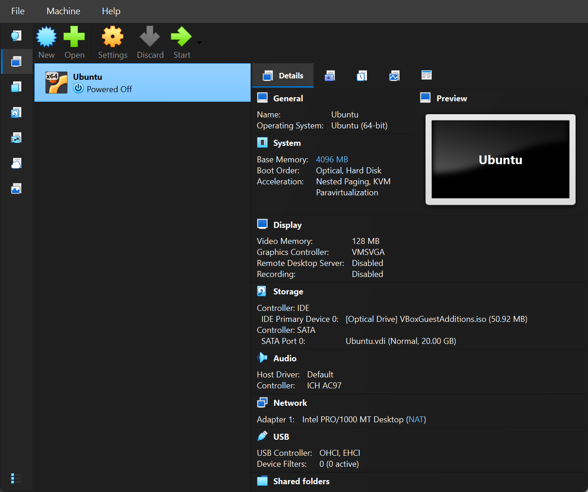

## Session 1a – Basic Command Line Navigation and Utilities

### Commands Practised
The following commands were used in this lab:
- `pwd` to show the current working directory
- `ls` to list files and folders
- `cd` to move between directories
- `mkdir` to create a new directory
- `touch` to create a new file
- `man` to read the manual page for a command

#### 1. Check the current working directory
The `pwd` command was used to display the current directory in the terminal.

    pwd

#### 2. List files and folders
The `ls` command was used to view the contents of the current directory.

    ls

A more detailed view was also displayed using:

    ls -l

Hidden files were displayed using:

    ls -a

#### 3. Move between directories
The `cd` command was used to move between directories.

    cd /home
    cd ~
    cd ..

#### 4. Create a new directory
A test directory was created using `mkdir`.

    mkdir lab1practice

#### 5. Create a new file
A new file was created inside the folder using `touch`.

    cd lab1practice
    touch testfile.txt
    ls -l

#### 6. View command manuals
The `man` command was used to read the manual page for a Linux command.

    man ls

#### 7. Explore important Linux directories
The following important directories were explored:
- `/home` – stores user files and personal folders
- `/etc` – stores system configuration files
- `/var` – stores variable data such as logs and cache

Example commands used:

    cd /home
    ls
    cd /etc
    ls
    cd /var
    ls

### Evidence
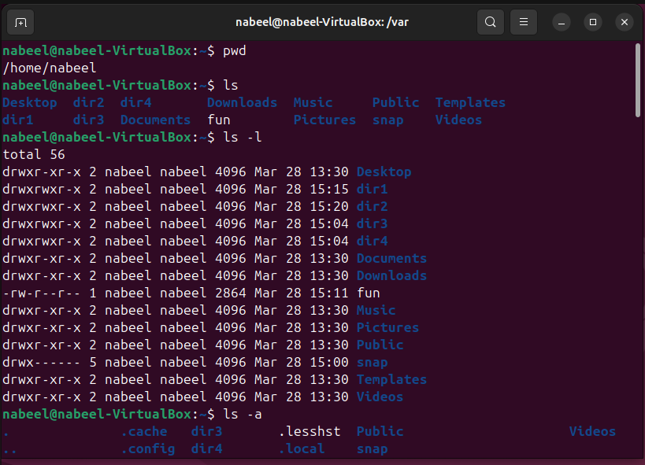
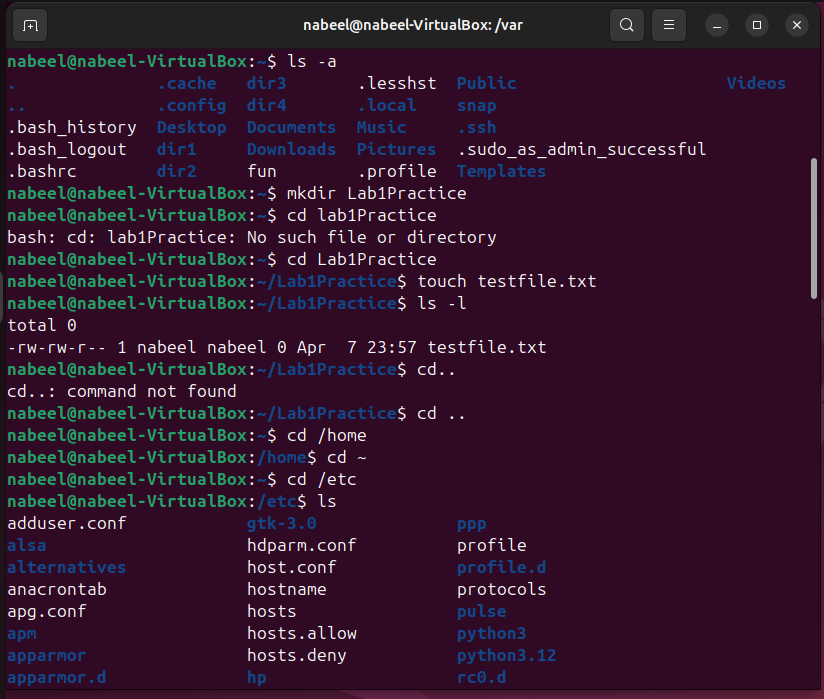
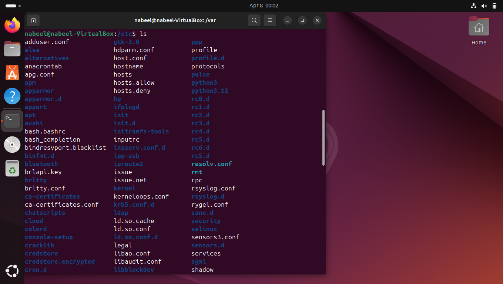
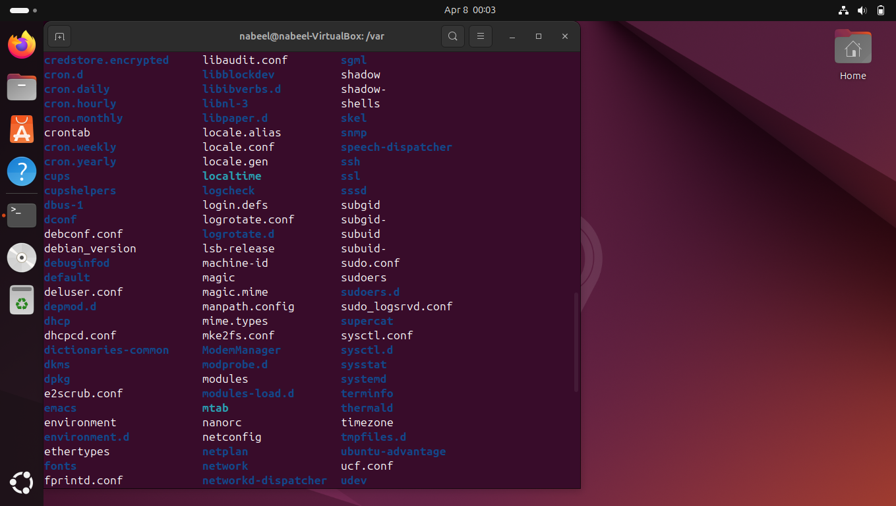
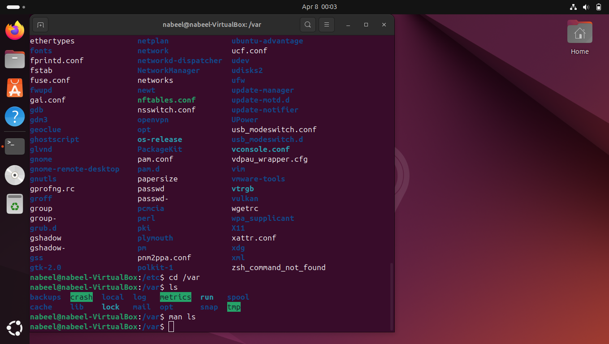
____________________________________

## Session 1b – Linux Services

### Steps Performed

#### 1. Update the package list
The package list was updated before installing the required services.

    sudo apt update

#### 2. Install Apache2
Apache2 was installed to set up a basic web server.

    sudo apt install apache2 -y

#### 3. Start Apache2 service
The Apache2 service was started using systemctl.

    sudo systemctl start apache2

#### 4. Check Apache2 status
The service status was checked to confirm that Apache2 was running successfully.

    sudo systemctl status apache2

#### 5. Open Apache in the browser
The Apache default web page was tested in the browser using the localhost address.

    http://127.0.0.1

#### 6. Install OpenSSH Server and Nmap
OpenSSH Server was installed to allow SSH access, and Nmap was installed for port scanning.

    sudo apt install openssh-server nmap -y

#### 7. Check SSH service status
The SSH service status was checked to confirm that the service was active.

    sudo systemctl status ssh

#### 8. Check the IP address
The IP address of the Ubuntu machine was checked.

    ip a

#### 9. Scan open ports
Nmap was used to scan the local machine for open ports.

    nmap 127.0.0.1

#### 10. Edit the Apache web page
The default Apache index page was edited.

    cd /var/www/html
    sudo nano index.html

A simple message was added to the page to verify that the web content had been changed.

#### 11. Enable firewall and allow HTTP
The firewall was enabled and HTTP traffic on port 80 was allowed.

    sudo ufw enable
    sudo ufw allow 80
    sudo ufw status

#### 12. Download a file using wget
A sample text file was downloaded from Project Gutenberg.

    wget https://www.gutenberg.org/files/1342/1342-0.txt

#### 13. Create a directory and archive the file
A new directory was created and the file was archived using tar.

    mkdir Books
    tar -cvf Books.tar Books

#### 14. Compress and decompress the archive
The archive was compressed using bzip2 and later decompressed.

    bzip2 Books.tar
    bunzip2 Books.tar.bz2

### Evidence
Screenshots were taken while installing Apache2, checking service status, viewing the Apache page in the browser, checking IP address, scanning ports, editing the web page, enabling the firewall, downloading the file, and creating the archive.

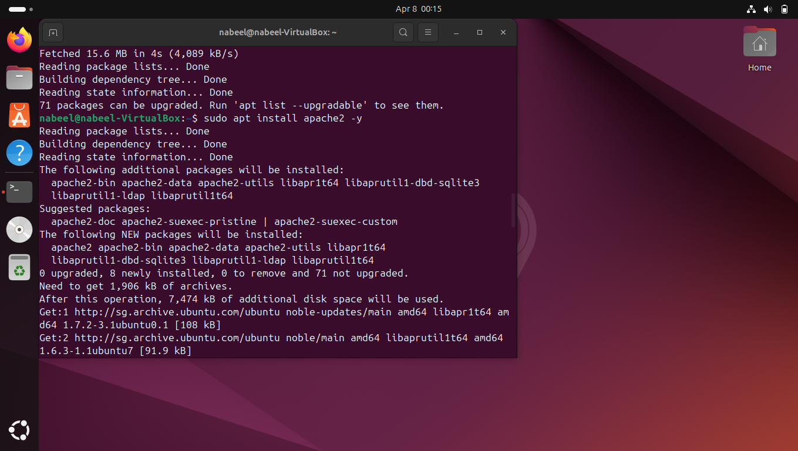
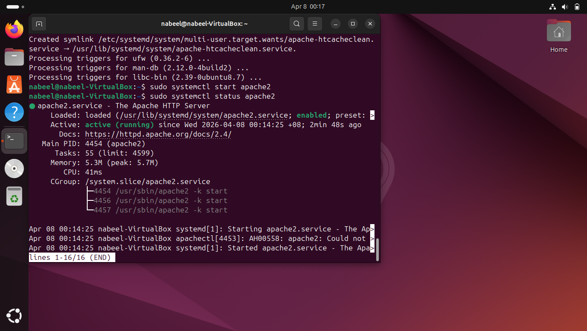
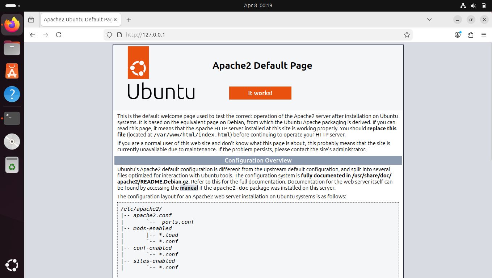
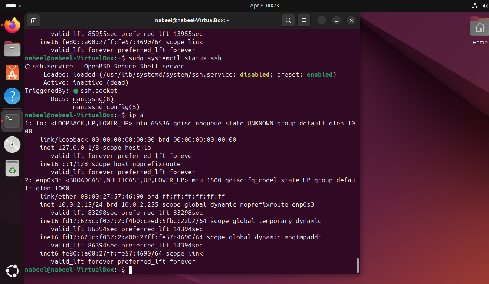
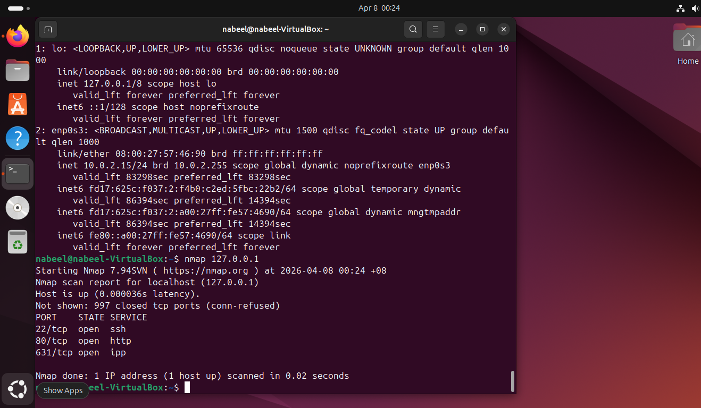
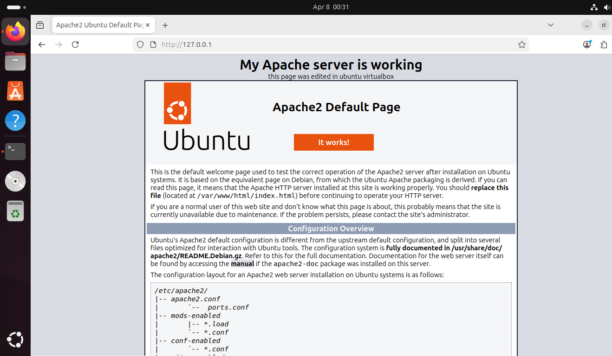
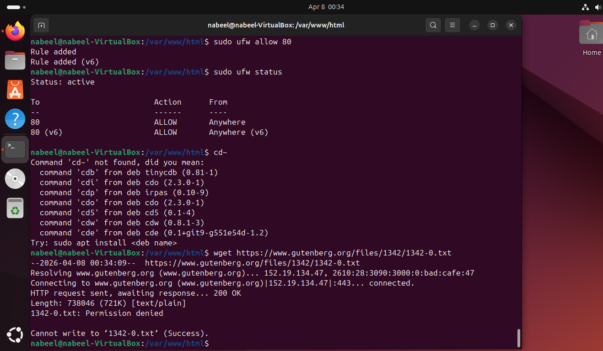
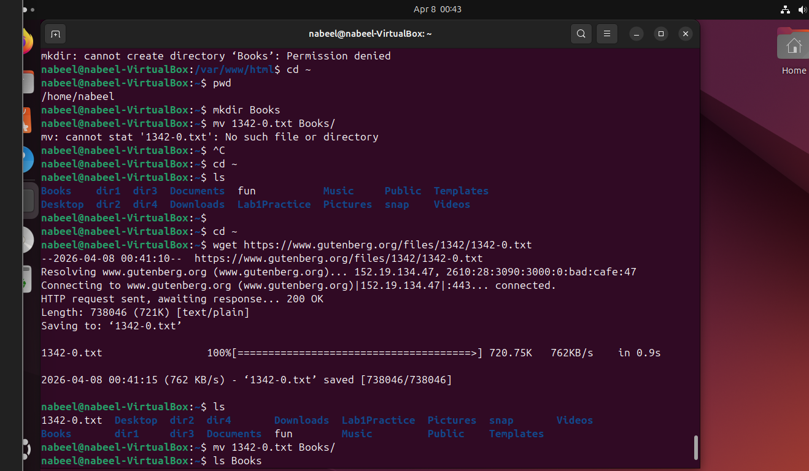
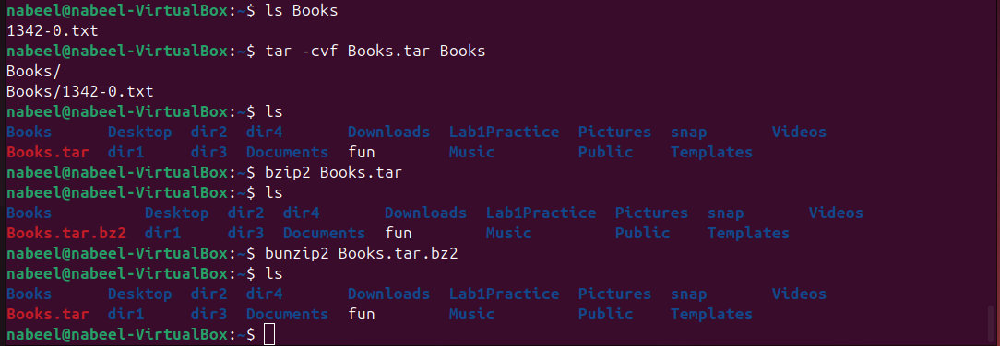

______________________________

## Session 1b – Searching Filesystems

### Steps Performed

#### 1. Create a test folder
A new folder was created for testing file search commands.

    mkdir SearchLab
    cd SearchLab

#### 2. Create sample files
Several sample files were created for search practice.

    touch file1.txt
    touch file2.txt
    touch notes.txt

#### 3. Add text into files
Sample text was added into the files using echo.

    echo "Hello world" > file1.txt
    echo "Linux is useful" > file2.txt
    echo "This is a search test" > notes.txt

#### 4. Search for a file by name
The `find` command was used to locate a specific file by name.

    find . -name "file1.txt"

#### 5. Search for text inside files
The `grep` command was used to search for text inside files.

    grep -r "Linux" .

#### 6. Search for another keyword
Another keyword was searched to check file contents.

    grep -r "search" .

#### 7. Combine search activities
Different files and keywords were searched to understand how file searching works in Linux.

### Evidence
Screenshots were taken while creating the test files and while using `find` and `grep` to search by filename and file content.

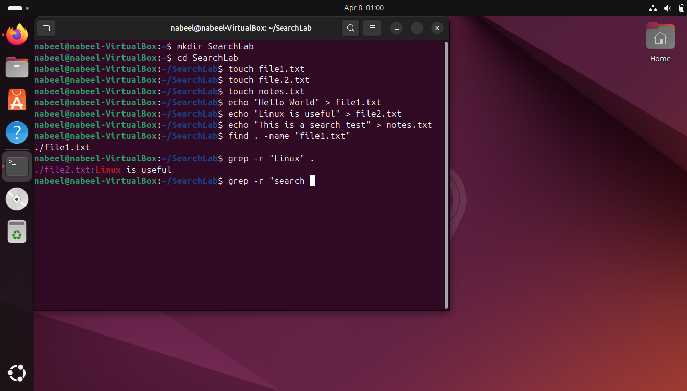
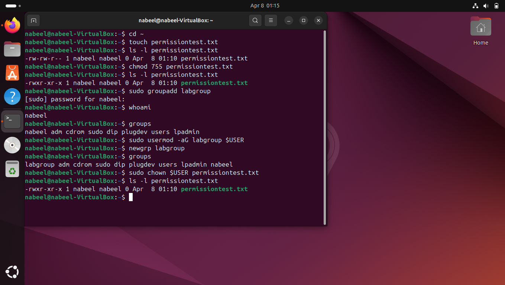

### Commands Used for Screenshots
The following command sequence was used to produce the screenshots for this lab section:

    mkdir SearchLab
    cd SearchLab
    touch file1.txt
    touch file2.txt
    touch notes.txt
    echo "Hello world" > file1.txt
    echo "Linux is useful" > file2.txt
    echo "This is a search test" > notes.txt
    find . -name "file1.txt"
    grep -r "Linux" .
    grep -r "search" .

