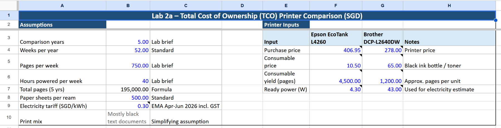
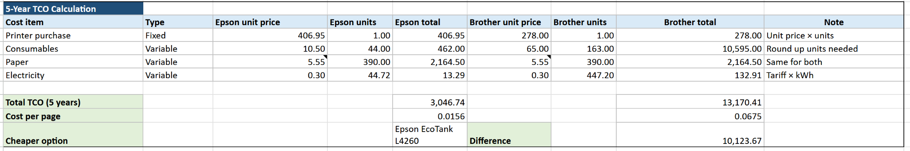
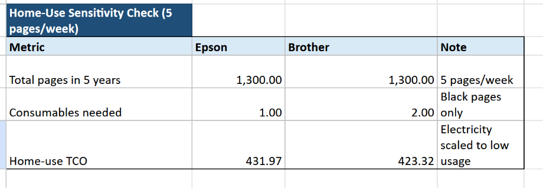
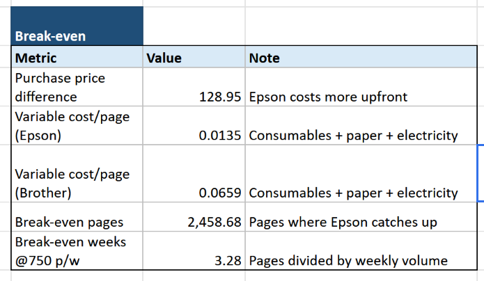

## Session 1a – Setting Up Linux

### Tasks Completed
- Prepared a GitHub repository for documenting lab activities.
- Downloaded the Ubuntu Desktop ISO from the official Ubuntu website.
- Installed Oracle VirtualBox.
- Downloaded ubuntu-24.04.4-desktop-amd64.iso
- Created a new Ubuntu virtual machine.
- Configured the virtual machine with suitable memory, processor, and storage settings.
- Mounted the Ubuntu ISO and completed the installation.
- Booted successfully into the Ubuntu desktop environment.

### Evidence

## Session 1a – Basic Command Line Navigation and Utilities

### Commands Practised
The following commands were used in this lab:
- `pwd` to show the current working directory
- `ls` to list files and folders
- `cd` to move between directories
- `mkdir` to create a new directory
- `touch` to create a new file
- `man` to read the manual page for a command

#### 1. Check the current working directory
The `pwd` command was used to display the current directory in the terminal.

    pwd

#### 2. List files and folders
The `ls` command was used to view the contents of the current directory.

    ls

A more detailed view was also displayed using:

    ls -l

Hidden files were displayed using:

    ls -a

#### 3. Move between directories
The `cd` command was used to move between directories.

    cd /home
    cd ~
    cd ..

#### 4. Create a new directory
A test directory was created using `mkdir`.

    mkdir lab1practice

#### 5. Create a new file
A new file was created inside the folder using `touch`.

    cd lab1practice
    touch testfile.txt
    ls -l

#### 6. View command manuals
The `man` command was used to read the manual page for a Linux command.

    man ls

#### 7. Explore important Linux directories
The following important directories were explored:
- `/home` – stores user files and personal folders
- `/etc` – stores system configuration files
- `/var` – stores variable data such as logs and cache

Example commands used:

    cd /home
    ls
    cd /etc
    ls
    cd /var
    ls

### Evidence

____________________________________

## Session 1b – Linux Services

### Steps Performed

#### 1. Update the package list
The package list was updated before installing the required services.

    sudo apt update

#### 2. Install Apache2
Apache2 was installed to set up a basic web server.

    sudo apt install apache2 -y

#### 3. Start Apache2 service
The Apache2 service was started using systemctl.

    sudo systemctl start apache2

#### 4. Check Apache2 status
The service status was checked to confirm that Apache2 was running successfully.

    sudo systemctl status apache2

#### 5. Open Apache in the browser
The Apache default web page was tested in the browser using the localhost address.

    http://127.0.0.1

#### 6. Install OpenSSH Server and Nmap
OpenSSH Server was installed to allow SSH access, and Nmap was installed for port scanning.

    sudo apt install openssh-server nmap -y

#### 7. Check SSH service status
The SSH service status was checked to confirm that the service was active.

    sudo systemctl status ssh

#### 8. Check the IP address
The IP address of the Ubuntu machine was checked.

    ip a

#### 9. Scan open ports
Nmap was used to scan the local machine for open ports.

    nmap 127.0.0.1

#### 10. Edit the Apache web page
The default Apache index page was edited.

    cd /var/www/html
    sudo nano index.html

A simple message was added to the page to verify that the web content had been changed.

#### 11. Enable firewall and allow HTTP
The firewall was enabled and HTTP traffic on port 80 was allowed.

    sudo ufw enable
    sudo ufw allow 80
    sudo ufw status

#### 12. Download a file using wget
A sample text file was downloaded from Project Gutenberg.

    wget https://www.gutenberg.org/files/1342/1342-0.txt

#### 13. Create a directory and archive the file
A new directory was created and the file was archived using tar.

    mkdir Books
    tar -cvf Books.tar Books

#### 14. Compress and decompress the archive
The archive was compressed using bzip2 and later decompressed.

    bzip2 Books.tar
    bunzip2 Books.tar.bz2

### Evidence
Screenshots were taken while installing Apache2, checking service status, viewing the Apache page in the browser, checking IP address, scanning ports, editing the web page, enabling the firewall, downloading the file, and creating the archive.

______________________________

## Session 1b – Searching Filesystems

### Steps Performed

#### 1. Create a test folder
A new folder was created for testing file search commands.

    mkdir SearchLab
    cd SearchLab

#### 2. Create sample files
Several sample files were created for search practice.

    touch file1.txt
    touch file2.txt
    touch notes.txt

#### 3. Add text into files
Sample text was added into the files using echo.

    echo "Hello world" > file1.txt
    echo "Linux is useful" > file2.txt
    echo "This is a search test" > notes.txt

#### 4. Search for a file by name
The `find` command was used to locate a specific file by name.

    find . -name "file1.txt"

#### 5. Search for text inside files
The `grep` command was used to search for text inside files.

    grep -r "Linux" .

#### 6. Search for another keyword
Another keyword was searched to check file contents.

    grep -r "search" .

#### 7. Combine search activities
Different files and keywords were searched to understand how file searching works in Linux.

### Evidence
Screenshots were taken while creating the test files and while using `find` and `grep` to search by filename and file content.

### Commands Used for Screenshots
The following command sequence was used to produce the screenshots for this lab section:

    mkdir SearchLab
    cd SearchLab
    touch file1.txt
    touch file2.txt
    touch notes.txt
    echo "Hello world" > file1.txt
    echo "Linux is useful" > file2.txt
    echo "This is a search test" > notes.txt
    find . -name "file1.txt"
    grep -r "Linux" .
    grep -r "search" .

___________________________________
___________________________________
## Session 1b – Linux Permissions

### Objective
The purpose of this task was to understand Linux file permissions and basic user and group management using commands such as `ls -l`, `chmod`, `chown`, and `chgrp`.

### Steps Performed

#### 1. Create a test file
A new file was created for testing file permissions.

    cd ~
    touch permissiontest.txt
    ls -l permissiontest.txt

#### 2. Change file permissions
The permissions of the file were changed using `chmod`.

    chmod 755 permissiontest.txt
    ls -l permissiontest.txt

#### 3. Create a new group
A new group was created for testing group management.

    sudo groupadd labgroup

#### 4. Check current user information
The current user and group information was checked.

    whoami
    groups

#### 5. Add the user to the group
The current user was added to the new group.

    sudo usermod -aG labgroup $USER
    groups

#### 6. Change file ownership and group
The ownership and group of the file were changed.

    sudo chown $USER permissiontest.txt
    sudo chgrp labgroup permissiontest.txt
    ls -l permissiontest.txt

#### 7. Verify the updated permissions and group
The file details were checked again to confirm the changes.

    ls -l permissiontest.txt

### Evidence
Screenshots were taken while creating the test file, viewing file permissions, changing permissions, creating a group, checking user group membership, and changing the file group.

### Commands Used for Screenshots
The following command sequence was used to produce the screenshots for this lab section:

    cd ~
    touch permissiontest.txt
    ls -l permissiontest.txt
    chmod 755 permissiontest.txt
    ls -l permissiontest.txt
    sudo groupadd labgroup
    whoami
    groups
    sudo usermod -aG labgroup $USER
    groups
    sudo chown $USER permissiontest.txt
    sudo chgrp labgroup permissiontest.txt
    ls -l permissiontest.txt
__________________________________

## Session 2a – Total Cost of Ownership (TCO)

### Printers Chosen
Two printers were selected for comparison:
- Printer A: Epson EcoTank L4260
- Printer B: Brother DCP-L2640DW Laser Printer

### Assumptions Used
The following assumptions were used in the spreadsheet:
- Comparison period: 5 years
- Weeks per year: 52
- Pages printed per week: 750
- Hours powered per week: 40
- Paper sheets per ream: 500
- Electricity tariff: S$0.30 per kWh
- Print mix: mostly black text documents

### Cost Components Considered
The following cost items were included:
- Printer purchase cost
- Consumables cost
- Paper cost
- Electricity cost

### Steps Performed
1. Chose two printer models for comparison.
2. Collected the prices of the printers and their consumables.
3. Defined assumptions based on the lab brief.
4. Created a spreadsheet to separate fixed and variable costs.
5. Calculated the 5-year TCO for each printer.
6. Calculated the cost per page for each printer.
7. Added a home-use sensitivity check for 5 pages per week.
8. Calculated the break-even point.

### Evidence

### Summary of Results
The final spreadsheet results showed:
- Epson EcoTank L4260 total TCO over 5 years: **S$3,046.74**
- Brother DCP-L2640DW total TCO over 5 years: **S$13,170.41**
- Epson cost per page: **S$0.0156**
- Brother cost per page: **S$0.0675**
- Cheaper option over 5 years: **Epson EcoTank L4260**
- Home-use TCO at 5 pages per week:
  - Epson: **S$431.97**
  - Brother: **S$423.32**
- Break-even point: **2,458.68 pages**
- Break-even time at 750 pages per week: **3.28 weeks**

### Reflection Questions

**1. Based on the TCO, which printer is the most cost-effective over 5 years?**  
Based on the spreadsheet results, the Epson EcoTank L4260 was the most cost-effective printer over 5 years. Although its purchase price was higher, its running cost was much lower, which made it cheaper overall in the long term.

**2. Would the answer change for a home user who prints only 5 pages per week?**  
Yes. For a home user who prints only 5 pages per week, the Brother printer was slightly cheaper overall. This is because the lower purchase price becomes more important when printing volume is very low.

**3. What other non-financial factors could influence printer selection?**  
Other factors include print quality, print speed, wireless features, duplex printing, reliability, ease of maintenance, and brand support. These factors may influence the decision even if one printer has a lower TCO.

**4. What cost components are more significant for a large workgroup printer?**  
For a large workgroup printer, consumables, maintenance, paper usage, electricity usage, and reliability are more significant. In high-volume printing, running cost becomes more important than the initial purchase price.

**5. At what point do the two printer options break even in cost?**  
The two printer options break even at approximately **2,458.68 pages**, which is about **3.28 weeks** at a printing rate of 750 pages per week. After this point, the Epson EcoTank becomes the cheaper option.

### File Submitted
The full TCO calculations were completed in a spreadsheet file, while the README provides a summary of the assumptions, results, and reflection answers.

